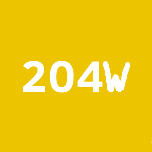

# 2040-Wait[^1]
2040-Wait allows kids to learn and practice mental arithmetic while being an addicting time sink!
# How To Play
It it just 2048 with a couple of twists:
* It is not just powers of 2
* Combine numbers with the same number of digits
* When combining, answer the simple arithmetic question (preferably in your head) to combine the numbers
* If you get the question wrong, a random tile will be <b>deleted</b>!
[^1]: Created by <a href="https://github.com/Anonymouseyy" target="_blank">Ethan Xie</a>. Based on <a href="https://github.com/gabrielecirulli/2048" target="_blank">2048 by Gabriele Cirulli</a>.
